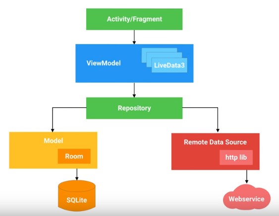

### Architecture Components: Improve Your App's Design

#### Content
In response to popular demand, the Android framework team has written an opinionated guide to architecting Android apps and developed a companion set of architecture components. These components persist data, manage lifecycle, make your app modular, help you avoid memory leaks and prevent you from having to write boring boilerplate code. Your basic Android app needs a database connected to a robust UI. The new components, Room, ViewModel, LiveData and Lifecycle, make that easy. They are also designed to fit together like building blocks, so let's see how.

I will tackle the database using Room, which is a new SQLite object mapping library. To set up the tables using Room, we can define a Plain Old Java Object or POJO. We then mark this POJO with the @Entity annotation and create an ID marked with the @PrimaryKey annotation. Now, for each POJO, you need to define a DAO or database access object. Then annotate the methods represent the SQLite commands that you need to interact with your POJO's data. Now take a look at this insert method and this query method. Room has automatically converted your POJO objects into the corresponding database tables and back again. Room also verifies your SQLite at compile time, so if you spell something a little bit wrong or you reference a column that's not actually in the database, it will throw a helpful error.

```java
@Entity
public class Trail {
	@PrimaryKey
	public String id;
	public String name;
	public double kilometers;
	public int difficulty;
}

@Dao
public interface TrailDao {
	//Create, read, update, delete examples
	@Insert(onConflict = IGNORE)
	void insertTrail(Trail trail);

	@Query("SELECT * FROM Trail")
	public List<Trail> findAllTrails();

	@Update(onConflict = REPLACE)
	void updateTrail(Trail trail);

	@Query("DELETE FROM Trail")
	void deleteAll();
}
```

Now that you have a Room database, you can use another new architecture component, called LiveData, to monitor changes in database. LiveData is an observable data holder. That means it holds data and notifies you when the data changes so that you can update the UI. LiveData is an abstract class that you can extend, or for simple cases, you can the MutableLiveData class. If you update the value of the MutableLiveData with a call to setValue(), it could then trigger and update in your UI. What's even more powerful though, is that Room is designed to support LiveData. To use them together, you just modify your Dao to return objects that are wrapped with the LiveData class. Room will create a LiveData object observing the database.

```java
@Dao
public interface TrailDao {
	//Create, read, update, delete examples
	@Insert(onConflict = IGNORE)
	void insertTrail(Trail trail);

	@Query("SELECT * FROM Trail")
	public LiveData<List<Trail>> findAllTrails();

	@Update(onConflict = REPLACE)
	void updateTrail(Trail trail);

	@Query("DELETE FROM Trail")
	void deleteAll();
}
```

Then you can write code like this to update your UI.

```java
trailsLiveData.observe(this, trails -> {
	//Update UI, in this case a RecyclerView
	mTrailsRecyclerAdapter.replaceItems(trails);
	mTrailsRecyclerAdapter.notifyDataSetChanged();
	});
```

The end result is that if your Room database updates, it changes the data in your LiveData object, which automatically triggers UI updates. This brings me to another awesome feature of LiveData. LiveData is a lifecycle aware component. Now you may be thinking what exactly is a lifecycle aware component. Well, I am glad that you asked. Through the magic of lifecycle observation, LiveData knows when you activity is on screen, off screen or destroyed, so that it doesn't send database updates to a non-active UI. There are two interfaces for this, LifecycleOwner and LifecycleObserver. Lifecycle Owners are objects with lifecycles, like Activities and Fragments. Lifecycle Observers, on the other hand, observe Lifecyle Owners and are notified of lifecycle changes. Here is a quick peek at the simplified code for LiveData, which is also a LifecycleObserver. The methods annotated with @OnLifecycleEvent take care of initialization and tear down when the associated LifecycleOwner starts and stops. This allows the LiveData objects to take care of their own set up and tear down. So the UI components observe the LiveData and the LiveData components observe the LifecycleOwners. As a side note to all you Android library designers out there, you can use the exact same lifecycle observation code to call set up and tear down functions automatically for your own libraries. 

Now you still have one more problem to solve. As your app is used, it will go through various configuration changes that destroy and rebuild the activity. We don't want to tire the initialization of LiveData to the Activity lifecycle because that causes a lot of needlessly re-executed code. An example of this is your database query, which is executed every time you rotate the phone. So what do you do? You put your LiveData and any other data associated with the UI in a ViewModel instead. View models are objects that provide data for UI components and survive configuration changes. To create a ViewModel object, you extend the ViewModel class. You then put all of the necessary data for your Activity UI into the ViewModel. Since you've cached data for the UI inside of the ViewModel, you app would not re-query the database if your Activity is re-created due to configuration changes. Then when you are creating your Activity or Fragment, you could get a reference to the ViewModel and use it. And that's it. The first time you get a ViewModel, it's generated from your Activity. When you request a ViewModel again, your activity receives the original ViewModel with the UI data cache. So there is no more useless database calls.

To summarize all of these new architecture shininess, we've talked about Room, which is an object mapping library for SQLite; LiveData, which notifies you when its data changes so that you can update the UI, and importantly it works well with Room so that you can easily update the UI when the database values change. We've also talked about Lifecycle Observers and Owners, which allow non-UI objects to observe lifecyle events. And finally, we talked about ViewModels, which provide you data objects that survive configuration changes. Altogether they make up a set of architecture components for writing modular, testable and robust Android apps. You can sensibly use them together or you can pick and choose what you need. But this is just the tip of the iceberg. In fact, a more fully-fledged Android app might look like this. 



For an in-depth look at how everything works together and the reasoning behind these components, check out the links in the description below. To jump straight into code and get started working with these objects, you can check out the Codelab and samples for lifecycle and persistence. Happy building and as always, don't forget to subscribe.


#### References
[Youtube Video](https://www.youtube.com/watch?v=vOJCrbr144o)

[Codelab](https://goo.gl/OBkIfC)

[Samples](https://goo.gl/9AzUSz)