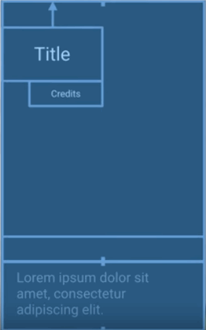

### Keyframe Animations with ConstraintLayout and ConstraintSet

#### Content
Who doesn't love building beautiful animations? They make our apps polished, improve engagement, and more importantly, they are fun to build. With ConstraintSet and ConstraintLayout, building fluent animations is easier than ever on Android. By specifying layouts for the start and end of animation as key frames, you can create complex animations with four lines of code. For this animation, our first layout file pushes the TextView off screen and expands the image to cover the entire screen. All views are styled in the first layout with text sizes, fonts and colours set to their final values. A second xml file holds the final element positions - the title, credits and description are on screen of this Keyframe. After loading it, the constraints in this layout apply to the view hierarchy. Next, TransitionManager caluates the paths between the old Keyframe and the new one, building a fluent animation. All that in four lines of code, and no custom map. How does it work?

First, create a ConstraintSet and load it from our second layout, which will serve as the second Keyframe. A ConstraintSet contains the constraints, sizes and margins from the layout and it is much cheaper to build than inflating a full layout. Since only the position information is loaded, you don't need to keep all the other styling in sync between the layouts. The colors and text sizes from the first layout will be used. Next, apply the constriantSet to the displayed view. ConstraintLayout immediately calculates the new positions for every child element. To make it animated, let TransitionManager to start a delayed transition. That's it. 

```kotlin
val constraintSet = ConstraintSet()
constraintSet.clone(R.layout.second_keyframe)

TransitionManager.beginDelayedTransition(myView)

constraintSet.applyTo(myView)
```

You're ready to apply ConstraintSet animations to your code. Of course, to use ConstraintSet, you'll need to use ConstraintLayout. Check out our early DevByte on ConstraintLayout and the Codelab, which covers new features in ConstraintLayout1.1. ConstraintLayout and ConstraintSet support API 9, so they'll work on all your supported devices. TransistionManager is available at API 14 in the support library. If you support older devices, your UI isn't effected. Users just won't get the animations. Now, you don't need to duplicate the layout file and for simple animations, you may want to build them in code. If you just want to change the bounds of a single view, ConstraintLayout will adjust the other views according to the constraints. In this example, it will change the height of the title, and the credit position animates smoothly as the title grows and shrinks. 



This shows another feature of ConstraintLayout animations. You get reverse animations without having to do reverse math. By default, TransitionManager will move and resize along a straight path with linear acceleration. To make your animations pop even more, specify custom transitions. Here is an example of using a different interpolator to add a bold effect to the animation. You customize the animation by passing a custom transition to TransitionManager. 

```kotlin
val transition = ChangeBounds()
transition.interpolator = AnticipateOvershootInterpolator(1.0f)

TransitionManager.beginDelayedTransition(myView, transition)
```

It's very easy to build fluent animation using ConstraintLayout and ConstraintSet. I can't wait to see what you build. Send me a gif of your animations on Twitter.

#### References
[Youtube Video](https://www.youtube.com/watch?v=OHcfs6rStRo)

[Codelab](https://goo.gl/ruyVop)