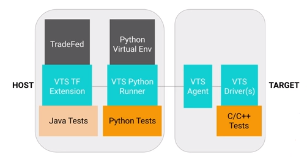
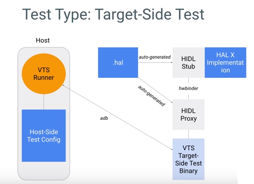
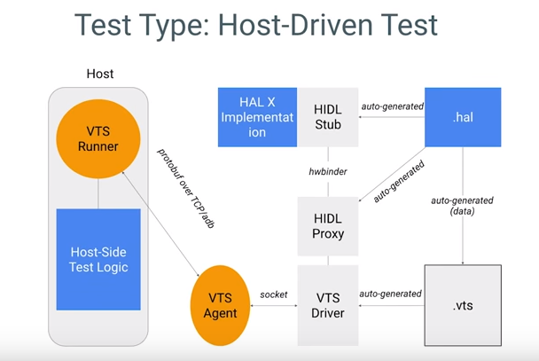

### VTS Test Framework and Simple Test Examples

#### Content
The VTS framework unifies various testing frameworks and help us develop various types of Android tests by using only one standard framework. I will explain the VTS framework and how to write two basic types of VTS tests by using it.

This shows the overall architecture of our test framework. It has host-side components and Android-target device-side components. TradeFed is used as a command-line user interface. Using the VTS TradeFed extensions, both host-side Java and Python tasks can be run. VTS host-side Python tests are run inside the Python Virtual Environment using the VTS Python Runner. On the target side, VTS Agent relays commands and responses between the host-side framework and VTS drivers. VTS drivers actually drives the target-side test, which is, for example, written in C/C++. This architecture allows VTS to process host-side Java and Python tests and a target-side C and Java test in Android. 



A VTS target-side test uses the target-side binary. The host-side code pushes the binary to a target device and executes the binary using ADB. It then retrieves and parses the test execution result. For HIDL HAL test, the test binary uses HIDL Proxy and Stub which are automatically generated from the HAL file by the HIDL gen tool.



A target-side HIDL HAL test can use a template as shown here. Then, the set method of a test looks like this. It has getService() to connect to a HAL service. Its test case can now call a HAL API just like this.

```cpp
class VtsHalLightTest : public VtsHalHidlTargetBaseTest {
	public:
	virtual void SetUp() override {
		light = VtsHalHidlTargetBaseTest::getService<ILight>();
		...
	}
};

TEST_F(VtsHalLightTest, TestSupported) {
	for(const Type& type : supportedTypes) {
		Return<Status> ret = light->setLight(type, kWhite);
		EXPECT_OK(ret);
	}
}
```

A VTS host-driven test allows developers to use VTS's single program multi-devices SPMD programming model. For example, host-driven test can control both the upper-layer, Java APIs and the lower-layer, HAL APIs within the same program and test case. It uses a VTS driver, which is automatically generated from the .hal files specification over target HAL.



This is an example of host-driven test. The host-side Python code connects to a HAL on the target device through a respective driver, and then calls its API. In this case, on() function uses 10000 as its argument to turn on the vibrator for 10000 milliseconds. For more information about how to develop VTS target-side and host-side test, please visit our Codelab. 

host_driven.py
```python
class VtsHalVibratorTest(baset_test.BaseTest):
	def setUpClass(self):
		self.dut = self.registerController(android_device)[0]
		self.dut.hal.InitHidlHal(...)
		...
	def testVibratorBasic(self):
		hal = self.dut.hal.vibrator
		types = hal.GetHidlTypeInterface("types")
		result = hal.on(10000)
		asserts.assertEqual(types.Status.OK, result)
```


#### References
[Youtube Video](https://www.youtube.com/watch?v=H6sgKtvyprA&index=1&list=PLWz5rJ2EKKc9FV7k8fvCX5uH333P2C_Lo)